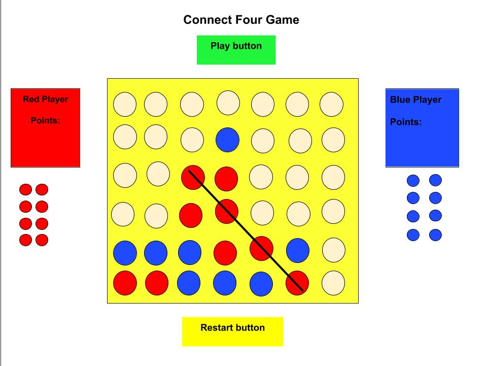

# connectfour
Testing the image
GA project1

I will be adding a "welcome to connect four game!" text animation

the api I'll be using is https://giphy.com/ . I would like for the api to generate a
"winner" gif when the player wins, or "looser" when the player lost.
